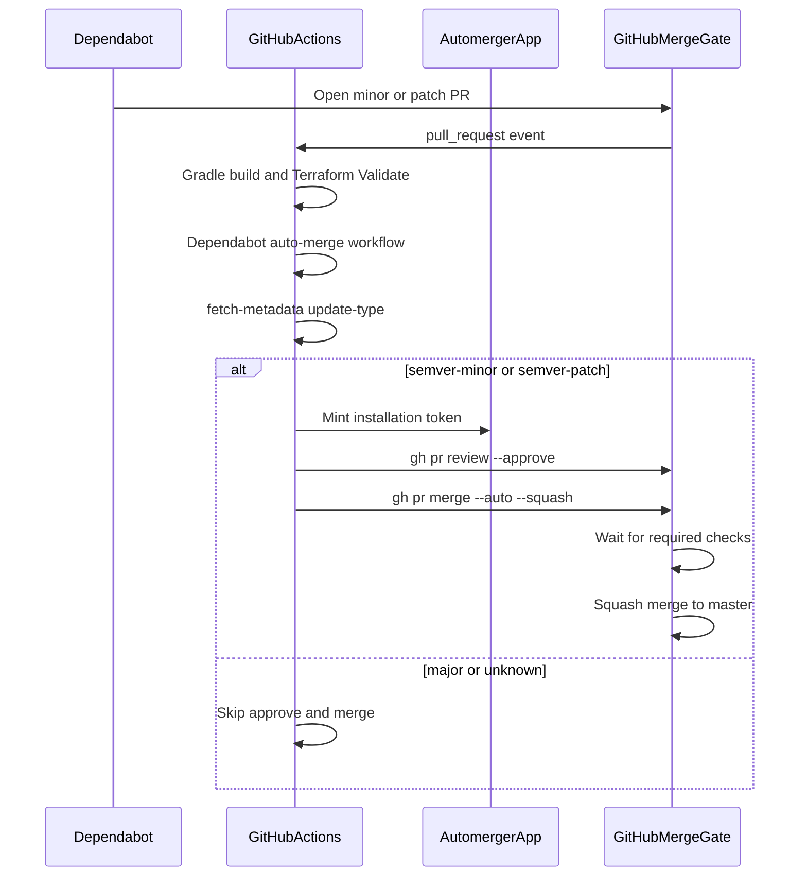
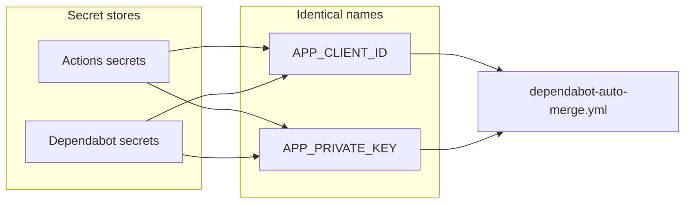

# Dependabot automation

Minor and patch Dependabot pull requests are approved and squash-merged by the `automerger` GitHub App after required CI passes. Major and non-semver updates stay open for manual review.

See [ADR-001](decisions/001-dependabot-auto-merge.md) for why a GitHub App is used and why code-owner reviews are **not** a merge gate.

## How it works

What gets auto-merged:

- `version-update:semver-minor`
- `version-update:semver-patch`

What stays manual:

- `version-update:semver-major`
- `version-update:semver-unknown`
- Any PR not authored by `dependabot[bot]`

`--auto` does **not** wait inside the job. GitHub merges later, only if branch protection is satisfied. If required status checks are missing, GitHub can squash-merge as soon as the App approves.

## Repository files

- [`.github/workflows/dependabot-auto-merge.yml`](../.github/workflows/dependabot-auto-merge.yml) — approve + enable squash auto-merge
- [`.github/dependabot.yml`](../.github/dependabot.yml) — daily gradle, terraform, and github-actions updates, `dependencies` label, assignee `@ealebed`
- [`.github/CODEOWNERS`](../.github/CODEOWNERS) — review requests to `@ealebed` (not a merge requirement)

The auto-merge workflow never checks out the pull request branch.

## GitHub App

App: `automerger` (user-owned). Webhook disabled. Installed on selected repositories.

Repository permissions:

- **Contents**: Read and write (merge)
- **Pull requests**: Read and write (approve, enable auto-merge)
- **Metadata**: Read-only (required)

The workflow mints a short-lived installation token with [`actions/create-github-app-token@v3`](https://github.com/actions/create-github-app-token) using **Client ID** + private key PEM. Do not use an OAuth client secret.

[Making authenticated API requests with a GitHub App in a workflow](https://docs.github.com/en/apps/creating-github-apps/authenticating-with-a-github-app/making-authenticated-api-requests-with-a-github-app-in-a-github-actions-workflow)

## Secrets

Dependabot-triggered `pull_request` jobs only see **Dependabot** secrets, not Actions secrets or variables. Store the **same names** in both stores:

| Name | Store | Value |
| --- | --- | --- |
| `APP_CLIENT_ID` | Actions **and** Dependabot secrets | GitHub App Client ID (`Iv1…` / `Iv23…`) |
| `APP_PRIVATE_KEY` | Actions **and** Dependabot secrets | Full PEM, including BEGIN/END lines |

If a Dependabot run fails with an empty Client ID or private key, the values were added only under Actions secrets.

## Branch protection (`master`)

Required so auto-merge cannot skip CI:

- Require a pull request before merging
- Required approving reviews: **1**
- **Do not** require review from Code Owners
- Dismiss stale reviews when new commits are pushed (the workflow re-approves on `synchronize`)
- Require status checks to pass before merging
- Required checks (both always run; Terraform Validation has no path filters):
  - `build` from [Java CI with Gradle](../.github/workflows/gradle.yml)
  - `Terraform Validate` from [Terraform Validation](../.github/workflows/terraform.yml)
- Require conversation resolution: **off**
- Allow auto-merge: **on**
- Squash merging: **on**
- No force pushes, no deletions

## Rollout order

App install, secrets, auto-merge, and squash are already configured. After this change reports both check names, require `build` **and** `Terraform Validate`. Merge into `master` last so a minor/patch Dependabot PR cannot merge before tests finish.

If only `build` is required, a Terraform Dependabot PR can squash-merge while Checkov or `terraform validate` is red.

## Verify

1. Minor or patch Dependabot PR: App approval, auto-merge queued, squash merge after `build` and `Terraform Validate` are green.
2. Major or `semver-unknown` Dependabot PR: workflow runs, no App approval, PR stays open.
3. Human PR: workflow job skipped (`dependabot[bot]` guard).
4. On a Dependabot-triggered run, `Create GitHub App token` can read both secrets.
